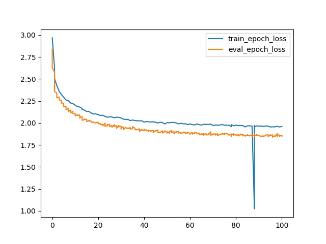
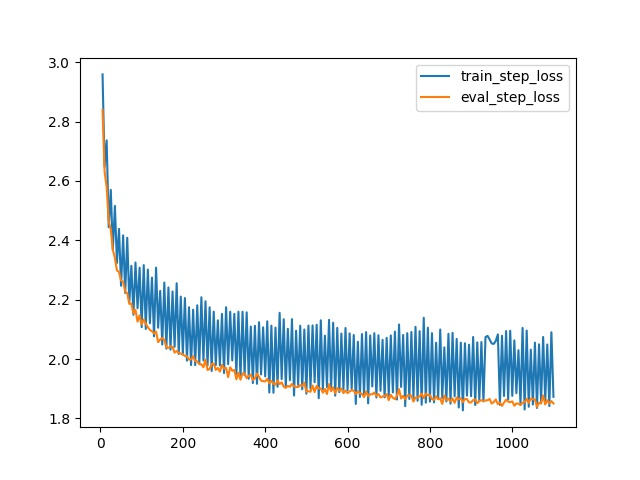

# classifying_names_with_a_character-level_RNN

## papers

```shell
The Unreasonable Effectiveness of Recurrent Neural Networks
https://karpathy.github.io/2015/05/21/rnn-effectiveness/

Understanding LSTM Networks
https://colah.github.io/posts/2015-08-Understanding-LSTMs/
```

## dataset

https://download.pytorch.org/tutorial/data.zip

```shell
unzip data.zip
```
Included in the ``data/names`` directory are 18 text files named as  
"[Language].txt". Each file contains a bunch of names, one name per  
line, mostly romanized (but we still need to convert from Unicode to  
ASCII).  

We'll end up with a dictionary of lists of names per language,  
``{language: [names ...]}``. The generic variables "category" and "line"  
(for language and name in our case) are used for later extensibility.  


## how to run

```shell
bash run.sh
```

## output

epoch loss  
  
step loss  
  

output  
```shell
RNN(
  (i2h): Linear(in_features=205, out_features=128, bias=True)
  (i2o): Linear(in_features=205, out_features=59, bias=True)
  (o2o): Linear(in_features=187, out_features=59, bias=True)
  (dropout): Dropout(p=0.1)
  (softmax): LogSoftmax()
)
config:
eval_epoch_steps : 10
train_load_check_point_file : True
num_workers : 4
momentum : 0.9
early_stop_epoch_limit : 10
optimizer : SGD
early_stop_epoch : True
train_epoch_steps : 10
dataset : names
steps : 100000
early_stop_step : True
n_hidden : 128
epoch_only : True
learn_rate : 0.0005
all_letters : abcdefghijklmnopqrstuvwxyzABCDEFGHIJKLMNOPQRSTUVWXYZ .,;'-
epochs : 100
n_letters : 59
batch_size : 1000
max_epoch_stop : True
max_step_stop : True
device : cpu
print_every : 5
data_path : ./data/names
loss : NLL
early_stop_step_limit : 100
[E: 0/100] [S: 5/100000] [Train: Loss:2.958800  5/10 (50%)] [Val: Loss:2.839336 0/10000 (0%)] [Best epoch:0 Loss:2.839336] [Best step:5 Loss:2.839336] [0.00s 0.0s]
[E: 0/100] [S: 10/100000] [Train: Loss:2.647621  10/10 (100%)] [Val: Loss:2.631263 0/10000 (0%)] [Best epoch:0 Loss:2.631263] [Best step:10 Loss:2.631263] [0.00s 0.0s]
[E: 0/100] [S: 10/100000] [Train: Loss:2.968491  10/10 (100%)] [Val: Loss:2.629430 0/10000 (0%)] [Best epoch:0 Loss:2.629430] [Best step:10 Loss:2.631263] [40.92s 40.9s]
[E: 1/100] [S: 15/100000] [Train: Loss:2.736446  5/10 (50%)] [Val: Loss:2.579854 0/10000 (0%)] [Best epoch:1 Loss:2.579854] [Best step:15 Loss:2.579854] [40.92s 40.9s]
[E: 1/100] [S: 20/100000] [Train: Loss:2.443919  10/10 (100%)] [Val: Loss:2.463921 0/10000 (0%)] [Best epoch:1 Loss:2.463921] [Best step:20 Loss:2.463921] [40.92s 40.9s]
[E: 1/100] [S: 20/100000] [Train: Loss:2.628853  10/10 (100%)] [Val: Loss:2.466182 0/10000 (0%)] [Best epoch:1 Loss:2.463921] [Best step:20 Loss:2.463921] [40.96s 81.9s]
[E: 2/100] [S: 25/100000] [Train: Loss:2.594146  5/10 (50%)] [Val: Loss:2.435748 0/10000 (0%)] [Best epoch:2 Loss:2.435748] [Best step:25 Loss:2.435748] [40.96s 81.9s]
[E: 2/100] [S: 30/100000] [Train: Loss:2.365779  10/10 (100%)] [Val: Loss:2.369891 0/10000 (0%)] [Best epoch:2 Loss:2.369891] [Best step:30 Loss:2.369891] [40.96s 81.9s]
[E: 1/100] [S: 25/100000] [Train: Loss:2.570118  5/10 (50%)] [Val: Loss:2.437161 0/10000 (0%)] [Best epoch:1 Loss:2.437161] [Best step:25 Loss:2.437161] [40.96s 81.9s] Step Status
[E: 1/100] [S: 30/100000] [Train: Loss:2.366355  10/10 (100%)] [Val: Loss:2.368035 0/10000 (0%)] [Best epoch:1 Loss:2.368035] [Best step:30 Loss:2.368035] [40.96s 81.9s] Step Status
[E: 1/100] [S: 30/100000] [Train: Loss:2.366355  10/10 (100%)] [Val: Loss:2.368035 0/10000 (0%)] [Best epoch:1 Loss:2.357966] [Best step:30 Loss:2.368035] [40.80s 122.7s] Epoch Status
[E: 2/100] [S: 35/100000] [Train: Loss:2.515979  5/10 (50%)] [Val: Loss:2.340214 0/10000 (0%)] [Best epoch:2 Loss:2.340214] [Best step:35 Loss:2.340214] [40.80s 122.7s] Step Status
[E: 2/100] [S: 40/100000] [Train: Loss:2.323779  10/10 (100%)] [Val: Loss:2.298239 0/10000 (0%)] [Best epoch:2 Loss:2.298239] [Best step:40 Loss:2.298239] [40.80s 122.7s] Step Status
[E: 2/100] [S: 40/100000] [Train: Loss:2.323779  10/10 (100%)] [Val: Loss:2.298239 0/10000 (0%)] [Best epoch:2 Loss:2.287091] [Best step:40 Loss:2.298239] [41.18s 163.9s] Epoch Status
[E: 3/100] [S: 45/100000] [Train: Loss:2.438657  5/10 (50%)] [Val: Loss:2.293576 0/10000 (0%)] [Best epoch:2 Loss:2.287091] [Best step:45 Loss:2.293576] [41.18s 163.9s] Step Status
[E: 3/100] [S: 50/100000] [Train: Loss:2.246784  10/10 (100%)] [Val: Loss:2.264124 0/10000 (0%)] [Best epoch:3 Loss:2.264124] [Best step:50 Loss:2.264124] [41.18s 163.9s] Step Status
[E: 3/100] [S: 50/100000] [Train: Loss:2.246784  10/10 (100%)] [Val: Loss:2.264124 0/10000 (0%)] [Best epoch:3 Loss:2.260864] [Best step:50 Loss:2.264124] [41.46s 205.3s] Epoch Status
[E: 4/100] [S: 55/100000] [Train: Loss:2.416693  5/10 (50%)] [Val: Loss:2.260192 0/10000 (0%)] [Best epoch:4 Loss:2.260192] [Best step:55 Loss:2.260192] [41.46s 205.3s] Step Status
[E: 4/100] [S: 60/100000] [Train: Loss:2.222714  10/10 (100%)] [Val: Loss:2.227812 0/10000 (0%)] [Best epoch:4 Loss:2.227812] [Best step:60 Loss:2.227812] [41.46s 205.3s] Step Status
[E: 4/100] [S: 60/100000] [Train: Loss:2.222714  10/10 (100%)] [Val: Loss:2.227812 0/10000 (0%)] [Best epoch:4 Loss:2.227812] [Best step:60 Loss:2.227812] [41.39s 246.7s] Epoch Status
[E: 5/100] [S: 65/100000] [Train: Loss:2.408526  5/10 (50%)] [Val: Loss:2.221667 0/10000 (0%)] [Best epoch:5 Loss:2.221667] [Best step:65 Loss:2.221667] [41.39s 246.7s] Step Status
[E: 5/100] [S: 70/100000] [Train: Loss:2.190458  10/10 (100%)] [Val: Loss:2.185826 0/10000 (0%)] [Best epoch:5 Loss:2.185826] [Best step:70 Loss:2.185826] [41.39s 246.7s] Step Status
[E: 5/100] [S: 70/100000] [Train: Loss:2.190458  10/10 (100%)] [Val: Loss:2.185826 0/10000 (0%)] [Best epoch:5 Loss:2.185826] [Best step:70 Loss:2.185826] [41.28s 288.0s] Epoch Status
[E: 6/100] [S: 75/100000] [Train: Loss:2.313870  5/10 (50%)] [Val: Loss:2.186711 0/10000 (0%)] [Best epoch:5 Loss:2.185826] [Best step:70 Loss:2.185826] [41.28s 288.0s] Step Status
[E: 6/100] [S: 80/100000] [Train: Loss:2.149164  10/10 (100%)] [Val: Loss:2.153440 0/10000 (0%)] [Best epoch:6 Loss:2.153440] [Best step:80 Loss:2.153440] [41.28s 288.0s] Step Status
[E: 6/100] [S: 80/100000] [Train: Loss:2.149164  10/10 (100%)] [Val: Loss:2.153440 0/10000 (0%)] [Best epoch:6 Loss:2.150477] [Best step:80 Loss:2.153440] [39.34s 327.3s] Epoch Status
[E: 7/100] [S: 85/100000] [Train: Loss:2.325105  5/10 (50%)] [Val: Loss:2.165497 0/10000 (0%)] [Best epoch:6 Loss:2.150477] [Best step:80 Loss:2.153440] [39.34s 327.3s] Step Status
[E: 7/100] [S: 90/100000] [Train: Loss:2.171192  10/10 (100%)] [Val: Loss:2.125976 0/10000 (0%)] [Best epoch:7 Loss:2.125976] [Best step:90 Loss:2.125976] [39.34s 327.3s] Step Status
[E: 7/100] [S: 90/100000] [Train: Loss:2.171192  10/10 (100%)] [Val: Loss:2.125976 0/10000 (0%)] [Best epoch:7 Loss:2.125976] [Best step:90 Loss:2.125976] [41.46s 368.8s] Epoch Status
[E: 8/100] [S: 95/100000] [Train: Loss:2.307920  5/10 (50%)] [Val: Loss:2.147382 0/10000 (0%)] [Best epoch:7 Loss:2.125976] [Best step:90 Loss:2.125976] [41.46s 368.8s] Step Status
[E: 8/100] [S: 100/100000] [Train: Loss:2.107451  10/10 (100%)] [Val: Loss:2.116395 0/10000 (0%)] [Best epoch:8 Loss:2.116395] [Best step:100 Loss:2.116395] [41.46s 368.8s] Step Status
[E: 8/100] [S: 100/100000] [Train: Loss:2.107451  10/10 (100%)] [Val: Loss:2.116395 0/10000 (0%)] [Best epoch:8 Loss:2.115855] [Best step:100 Loss:2.116395] [41.35s 410.1s] Epoch Status
[E: 9/100] [S: 105/100000] [Train: Loss:2.316520  5/10 (50%)] [Val: Loss:2.133158 0/10000 (0%)] [Best epoch:8 Loss:2.115855] [Best step:100 Loss:2.116395] [41.35s 410.1s] Step Status
[E: 9/100] [S: 110/100000] [Train: Loss:2.101270  10/10 (100%)] [Val: Loss:2.119242 0/10000 (0%)] [Best epoch:8 Loss:2.115855] [Best step:100 Loss:2.116395] [41.35s 410.1s] Step Status
[E: 9/100] [S: 110/100000] [Train: Loss:2.101270  10/10 (100%)] [Val: Loss:2.119242 0/10000 (0%)] [Best epoch:9 Loss:2.107559] [Best step:100 Loss:2.116395] [41.22s 451.4s] Epoch Status
[E: 10/100] [S: 115/100000] [Train: Loss:2.301298  5/10 (50%)] [Val: Loss:2.107354 0/10000 (0%)] [Best epoch:10 Loss:2.107354] [Best step:115 Loss:2.107354] [41.22s 451.4s] Step Status
[E: 10/100] [S: 120/100000] [Train: Loss:2.120560  10/10 (100%)] [Val: Loss:2.098027 0/10000 (0%)] [Best epoch:10 Loss:2.098027] [Best step:120 Loss:2.098027] [41.22s 451.4s] Step Status
[E: 10/100] [S: 120/100000] [Train: Loss:2.120560  10/10 (100%)] [Val: Loss:2.098027 0/10000 (0%)] [Best epoch:10 Loss:2.081124] [Best step:120 Loss:2.098027] [41.28s 492.6s] Epoch Status
[E: 11/100] [S: 125/100000] [Train: Loss:2.274269  5/10 (50%)] [Val: Loss:2.093999 0/10000 (0%)] [Best epoch:10 Loss:2.081124] [Best step:125 Loss:2.093999] [41.28s 492.6s] Step Status
[E: 11/100] [S: 130/100000] [Train: Loss:2.076419  10/10 (100%)] [Val: Loss:2.086819 0/10000 (0%)] [Best epoch:10 Loss:2.081124] [Best step:130 Loss:2.086819] [41.28s 492.6s] Step Status
[E: 11/100] [S: 130/100000] [Train: Loss:2.076419  10/10 (100%)] [Val: Loss:2.086819 0/10000 (0%)] [Best epoch:10 Loss:2.081124] [Best step:130 Loss:2.086819] [41.07s 533.7s] Epoch Status
[E: 12/100] [S: 135/100000] [Train: Loss:2.307883  5/10 (50%)] [Val: Loss:2.092391 0/10000 (0%)] [Best epoch:10 Loss:2.081124] [Best step:130 Loss:2.086819] [41.07s 533.7s] Step Status
[E: 12/100] [S: 140/100000] [Train: Loss:2.105602  10/10 (100%)] [Val: Loss:2.056846 0/10000 (0%)] [Best epoch:12 Loss:2.056846] [Best step:140 Loss:2.056846] [41.07s 533.7s] Step Status
[E: 12/100] [S: 140/100000] [Train: Loss:2.105602  10/10 (100%)] [Val: Loss:2.056846 0/10000 (0%)] [Best epoch:12 Loss:2.056846] [Best step:140 Loss:2.056846] [40.88s 574.6s] Epoch Status
[E: 13/100] [S: 145/100000] [Train: Loss:2.229566  5/10 (50%)] [Val: Loss:2.066366 0/10000 (0%)] [Best epoch:12 Loss:2.056846] [Best step:140 Loss:2.056846] [40.88s 574.6s] Step Status
[E: 13/100] [S: 150/100000] [Train: Loss:2.048885  10/10 (100%)] [Val: Loss:2.070952 0/10000 (0%)] [Best epoch:12 Loss:2.056846] [Best step:140 Loss:2.056846] [40.88s 574.6s] Step Status
[E: 13/100] [S: 150/100000] [Train: Loss:2.048885  10/10 (100%)] [Val: Loss:2.070952 0/10000 (0%)] [Best epoch:13 Loss:2.052732] [Best step:140 Loss:2.056846] [40.91s 615.5s] Epoch Status
[E: 14/100] [S: 155/100000] [Train: Loss:2.234232  5/10 (50%)] [Val: Loss:2.075228 0/10000 (0%)] [Best epoch:13 Loss:2.052732] [Best step:140 Loss:2.056846] [40.91s 615.5s] Step Status
[E: 13/100] [S: 155/100000] [Train: Loss:2.257734  5/10 (50%)] [Val: Loss:2.064717] [Best epoch:13 Loss:2.052732] [Best step:140 Loss:2.056846] [40.91s 615.5s] Step Status
[E: 13/100] [S: 160/100000] [Train: Loss:2.035141  10/10 (100%)] [Val: Loss:2.039078] [Best epoch:13 Loss:2.039078] [Best step:160 Loss:2.039078] [40.91s 615.5s] Step Status
[E: 13/100] [S: 160/100000] [Train: Loss:2.035141  10/10 (100%)] [Val: Loss:2.039078] [Best epoch:13 Loss:2.029834] [Best step:160 Loss:2.039078] [42.38s 657.9s] Epoch Status
[E: 14/100] [S: 165/100000] [Train: Loss:2.241119  5/10 (50%)] [Val: Loss:2.037968] [Best epoch:13 Loss:2.029834] [Best step:165 Loss:2.037968] [42.38s 657.9s] Step Status
[E: 14/100] [S: 170/100000] [Train: Loss:2.031683  10/10 (100%)] [Val: Loss:2.042479] [Best epoch:13 Loss:2.029834] [Best step:165 Loss:2.037968] [42.38s 657.9s] Step Status
[E: 14/100] [S: 170/100000] [Train: Loss:2.031683  10/10 (100%)] [Val: Loss:2.042479] [Best epoch:13 Loss:2.029834] [Best step:165 Loss:2.037968] [40.78s 698.6s] Epoch Status
[E: 15/100] [S: 175/100000] [Train: Loss:2.227793  5/10 (50%)] [Val: Loss:2.041410] [Best epoch:13 Loss:2.029834] [Best step:165 Loss:2.037968] [40.78s 698.6s] Step Status
[E: 15/100] [S: 180/100000] [Train: Loss:2.041359  10/10 (100%)] [Val: Loss:2.021471] [Best epoch:15 Loss:2.021471] [Best step:180 Loss:2.021471] [40.78s 698.6s] Step Status
[E: 15/100] [S: 180/100000] [Train: Loss:2.041359  10/10 (100%)] [Val: Loss:2.021471] [Best epoch:15 Loss:2.016103] [Best step:180 Loss:2.021471] [41.15s 739.8s] Epoch Status
[E: 16/100] [S: 185/100000] [Train: Loss:2.255320  5/10 (50%)] [Val: Loss:2.027396] [Best epoch:15 Loss:2.016103] [Best step:180 Loss:2.021471] [41.15s 739.8s] Step Status
[E: 16/100] [S: 190/100000] [Train: Loss:2.016954  10/10 (100%)] [Val: Loss:2.019632] [Best epoch:15 Loss:2.016103] [Best step:190 Loss:2.019632] [41.15s 739.8s] Step Status
[E: 16/100] [S: 190/100000] [Train: Loss:2.016954  10/10 (100%)] [Val: Loss:2.019632] [Best epoch:15 Loss:2.016103] [Best step:190 Loss:2.019632] [40.85s 780.6s] Epoch Status
[E: 17/100] [S: 195/100000] [Train: Loss:2.210386  5/10 (50%)] [Val: Loss:2.018931] [Best epoch:15 Loss:2.016103] [Best step:195 Loss:2.018931] [40.85s 780.6s] Step Status
[E: 17/100] [S: 200/100000] [Train: Loss:2.015529  10/10 (100%)] [Val: Loss:2.015603] [Best epoch:17 Loss:2.015603] [Best step:200 Loss:2.015603] [40.85s 780.6s] Step Status
[E: 17/100] [S: 200/100000] [Train: Loss:2.015529  10/10 (100%)] [Val: Loss:2.015603] [Best epoch:17 Loss:2.008050] [Best step:200 Loss:2.015603] [41.84s 822.5s] Epoch Status
[E: 18/100] [S: 205/100000] [Train: Loss:2.205651  5/10 (50%)] [Val: Loss:2.010209] [Best epoch:17 Loss:2.008050] [Best step:205 Loss:2.010209] [41.84s 822.5s] Step Status
[E: 18/100] [S: 210/100000] [Train: Loss:1.994571  10/10 (100%)] [Val: Loss:2.009710] [Best epoch:17 Loss:2.008050] [Best step:210 Loss:2.009710] [41.84s 822.5s] Step Status
[E: 18/100] [S: 210/100000] [Train: Loss:1.994571  10/10 (100%)] [Val: Loss:2.009710] [Best epoch:18 Loss:2.007957] [Best step:210 Loss:2.009710] [42.08s 864.6s] Epoch Status
[E: 19/100] [S: 215/100000] [Train: Loss:2.174539  5/10 (50%)] [Val: Loss:1.998360] [Best epoch:19 Loss:1.998360] [Best step:215 Loss:1.998360] [42.08s 864.6s] Step Status
[E: 19/100] [S: 220/100000] [Train: Loss:1.979668  10/10 (100%)] [Val: Loss:1.998875] [Best epoch:19 Loss:1.998360] [Best step:215 Loss:1.998360] [42.08s 864.6s] Step Status
[E: 19/100] [S: 220/100000] [Train: Loss:1.979668  10/10 (100%)] [Val: Loss:1.998875] [Best epoch:19 Loss:1.998360] [Best step:215 Loss:1.998360] [41.64s 906.2s] Epoch Status
[E: 20/100] [S: 225/100000] [Train: Loss:2.166494  5/10 (50%)] [Val: Loss:2.009735] [Best epoch:19 Loss:1.998360] [Best step:215 Loss:1.998360] [41.64s 906.2s] Step Status
[E: 20/100] [S: 230/100000] [Train: Loss:1.979496  10/10 (100%)] [Val: Loss:1.992891] [Best epoch:20 Loss:1.992891] [Best step:230 Loss:1.992891] [41.64s 906.2s] Step Status
[E: 20/100] [S: 230/100000] [Train: Loss:1.979496  10/10 (100%)] [Val: Loss:1.992891] [Best epoch:20 Loss:1.990005] [Best step:230 Loss:1.992891] [41.42s 947.6s] Epoch Status
[E: 21/100] [S: 235/100000] [Train: Loss:2.181115  5/10 (50%)] [Val: Loss:1.992606] [Best epoch:20 Loss:1.990005] [Best step:235 Loss:1.992606] [41.42s 947.6s] Step Status
[E: 21/100] [S: 240/100000] [Train: Loss:1.984554  10/10 (100%)] [Val: Loss:1.982626] [Best epoch:21 Loss:1.982626] [Best step:240 Loss:1.982626] [41.42s 947.6s] Step Status
[E: 21/100] [S: 240/100000] [Train: Loss:1.984554  10/10 (100%)] [Val: Loss:1.982626] [Best epoch:21 Loss:1.980919] [Best step:240 Loss:1.982626] [41.36s 989.0s] Epoch Status
[E: 22/100] [S: 245/100000] [Train: Loss:2.208210  5/10 (50%)] [Val: Loss:1.982364] [Best epoch:21 Loss:1.980919] [Best step:245 Loss:1.982364] [41.36s 989.0s] Step Status
[E: 22/100] [S: 250/100000] [Train: Loss:1.995520  10/10 (100%)] [Val: Loss:1.972326] [Best epoch:22 Loss:1.972326] [Best step:250 Loss:1.972326] [41.36s 989.0s] Step Status
[E: 22/100] [S: 250/100000] [Train: Loss:1.995520  10/10 (100%)] [Val: Loss:1.972326] [Best epoch:22 Loss:1.967650] [Best step:250 Loss:1.972326] [40.36s 1029.3s] Epoch Status
[E: 23/100] [S: 255/100000] [Train: Loss:2.194680  5/10 (50%)] [Val: Loss:1.998370] [Best epoch:22 Loss:1.967650] [Best step:250 Loss:1.972326] [40.36s 1029.3s] Step Status
[E: 23/100] [S: 260/100000] [Train: Loss:1.978827  10/10 (100%)] [Val: Loss:1.963154] [Best epoch:23 Loss:1.963154] [Best step:260 Loss:1.963154] [40.36s 1029.3s] Step Status
[E: 23/100] [S: 260/100000] [Train: Loss:1.978827  10/10 (100%)] [Val: Loss:1.963154] [Best epoch:23 Loss:1.963154] [Best step:260 Loss:1.963154] [40.96s 1070.3s] Epoch Status
[E: 24/100] [S: 265/100000] [Train: Loss:2.174197  5/10 (50%)] [Val: Loss:1.966529] [Best epoch:23 Loss:1.963154] [Best step:260 Loss:1.963154] [40.96s 1070.3s] Step Status
[E: 24/100] [S: 270/100000] [Train: Loss:1.959994  10/10 (100%)] [Val: Loss:1.983517] [Best epoch:23 Loss:1.963154] [Best step:260 Loss:1.963154] [40.96s 1070.3s] Step Status
[E: 24/100] [S: 270/100000] [Train: Loss:1.959994  10/10 (100%)] [Val: Loss:1.983517] [Best epoch:23 Loss:1.963154] [Best step:260 Loss:1.963154] [41.86s 1112.2s] Epoch Status
[E: 25/100] [S: 275/100000] [Train: Loss:2.159598  5/10 (50%)] [Val: Loss:1.984419] [Best epoch:23 Loss:1.963154] [Best step:260 Loss:1.963154] [41.86s 1112.2s] Step Status
[E: 25/100] [S: 280/100000] [Train: Loss:1.979528  10/10 (100%)] [Val: Loss:1.963436] [Best epoch:23 Loss:1.963154] [Best step:260 Loss:1.963154] [41.86s 1112.2s] Step Status
[E: 25/100] [S: 280/100000] [Train: Loss:1.979528  10/10 (100%)] [Val: Loss:1.963436] [Best epoch:25 Loss:1.957630] [Best step:260 Loss:1.963154] [41.30s 1153.5s] Epoch Status
[E: 26/100] [S: 285/100000] [Train: Loss:2.130409  5/10 (50%)] [Val: Loss:1.970360] [Best epoch:25 Loss:1.957630] [Best step:260 Loss:1.963154] [41.30s 1153.5s] Step Status
[E: 26/100] [S: 290/100000] [Train: Loss:1.978043  10/10 (100%)] [Val: Loss:1.957776] [Best epoch:25 Loss:1.957630] [Best step:290 Loss:1.957776] [41.30s 1153.5s] Step Status
[E: 26/100] [S: 290/100000] [Train: Loss:1.978043  10/10 (100%)] [Val: Loss:1.957776] [Best epoch:26 Loss:1.951593] [Best step:290 Loss:1.957776] [41.44s 1194.9s] Epoch Status
[E: 27/100] [S: 295/100000] [Train: Loss:2.152310  5/10 (50%)] [Val: Loss:1.980502] [Best epoch:26 Loss:1.951593] [Best step:290 Loss:1.957776] [41.44s 1194.9s] Step Status
[E: 27/100] [S: 300/100000] [Train: Loss:1.952723  10/10 (100%)] [Val: Loss:1.967907] [Best epoch:26 Loss:1.951593] [Best step:290 Loss:1.957776] [41.44s 1194.9s] Step Status
[E: 27/100] [S: 300/100000] [Train: Loss:1.952723  10/10 (100%)] [Val: Loss:1.967907] [Best epoch:26 Loss:1.951593] [Best step:290 Loss:1.957776] [41.44s 1236.3s] Epoch Status
[E: 28/100] [S: 305/100000] [Train: Loss:2.174429  5/10 (50%)] [Val: Loss:1.970140] [Best epoch:26 Loss:1.951593] [Best step:290 Loss:1.957776] [41.44s 1236.3s] Step Status
[E: 28/100] [S: 310/100000] [Train: Loss:1.982891  10/10 (100%)] [Val: Loss:1.939031] [Best epoch:28 Loss:1.939031] [Best step:310 Loss:1.939031] [41.44s 1236.3s] Step Status
[E: 28/100] [S: 310/100000] [Train: Loss:1.982891  10/10 (100%)] [Val: Loss:1.939031] [Best epoch:28 Loss:1.938714] [Best step:310 Loss:1.939031] [40.50s 1276.8s] Epoch Status
[E: 29/100] [S: 315/100000] [Train: Loss:2.159388  5/10 (50%)] [Val: Loss:1.972219] [Best epoch:28 Loss:1.938714] [Best step:310 Loss:1.939031] [40.50s 1276.8s] Step Status
[E: 29/100] [S: 320/100000] [Train: Loss:1.995365  10/10 (100%)] [Val: Loss:1.960712] [Best epoch:28 Loss:1.938714] [Best step:310 Loss:1.939031] [40.50s 1276.8s] Step Status
[E: 29/100] [S: 320/100000] [Train: Loss:1.995365  10/10 (100%)] [Val: Loss:1.960712] [Best epoch:28 Loss:1.938714] [Best step:310 Loss:1.939031] [41.66s 1318.5s] Epoch Status
[E: 30/100] [S: 325/100000] [Train: Loss:2.152210  5/10 (50%)] [Val: Loss:1.963313] [Best epoch:28 Loss:1.938714] [Best step:310 Loss:1.939031] [41.66s 1318.5s] Step Status
[E: 30/100] [S: 330/100000] [Train: Loss:1.949806  10/10 (100%)] [Val: Loss:1.931696] [Best epoch:30 Loss:1.931696] [Best step:330 Loss:1.931696] [41.66s 1318.5s] Step Status
[E: 30/100] [S: 330/100000] [Train: Loss:1.949806  10/10 (100%)] [Val: Loss:1.931696] [Best epoch:30 Loss:1.931696] [Best step:330 Loss:1.931696] [41.30s 1359.8s] Epoch Status
[E: 31/100] [S: 335/100000] [Train: Loss:2.159567  5/10 (50%)] [Val: Loss:1.954208] [Best epoch:30 Loss:1.931696] [Best step:330 Loss:1.931696] [41.30s 1359.8s] Step Status
[E: 31/100] [S: 340/100000] [Train: Loss:1.935978  10/10 (100%)] [Val: Loss:1.930401] [Best epoch:31 Loss:1.930401] [Best step:340 Loss:1.930401] [41.30s 1359.8s] Step Status
[E: 31/100] [S: 340/100000] [Train: Loss:1.935978  10/10 (100%)] [Val: Loss:1.930401] [Best epoch:31 Loss:1.923305] [Best step:340 Loss:1.930401] [41.54s 1401.3s] Epoch Status
[E: 32/100] [S: 345/100000] [Train: Loss:2.159432  5/10 (50%)] [Val: Loss:1.952113] [Best epoch:31 Loss:1.923305] [Best step:340 Loss:1.930401] [41.54s 1401.3s] Step Status
[E: 32/100] [S: 350/100000] [Train: Loss:1.945100  10/10 (100%)] [Val: Loss:1.951613] [Best epoch:31 Loss:1.923305] [Best step:340 Loss:1.930401] [41.54s 1401.3s] Step Status
[E: 32/100] [S: 350/100000] [Train: Loss:1.945100  10/10 (100%)] [Val: Loss:1.951613] [Best epoch:31 Loss:1.923305] [Best step:340 Loss:1.930401] [41.37s 1442.7s] Epoch Status
[E: 33/100] [S: 355/100000] [Train: Loss:2.157381  5/10 (50%)] [Val: Loss:1.935304] [Best epoch:31 Loss:1.923305] [Best step:340 Loss:1.930401] [41.37s 1442.7s] Step Status
[E: 33/100] [S: 360/100000] [Train: Loss:1.933681  10/10 (100%)] [Val: Loss:1.942710] [Best epoch:31 Loss:1.923305] [Best step:340 Loss:1.930401] [41.37s 1442.7s] Step Status
[E: 33/100] [S: 360/100000] [Train: Loss:1.933681  10/10 (100%)] [Val: Loss:1.942710] [Best epoch:31 Loss:1.923305] [Best step:340 Loss:1.930401] [41.64s 1484.3s] Epoch Status
[E: 34/100] [S: 365/100000] [Train: Loss:2.109733  5/10 (50%)] [Val: Loss:1.947736] [Best epoch:31 Loss:1.923305] [Best step:340 Loss:1.930401] [41.64s 1484.3s] Step Status
[E: 34/100] [S: 370/100000] [Train: Loss:1.919202  10/10 (100%)] [Val: Loss:1.929376] [Best epoch:31 Loss:1.923305] [Best step:370 Loss:1.929376] [41.64s 1484.3s] Step Status
[E: 34/100] [S: 370/100000] [Train: Loss:1.919202  10/10 (100%)] [Val: Loss:1.929376] [Best epoch:31 Loss:1.923305] [Best step:370 Loss:1.929376] [41.80s 1526.1s] Epoch Status
[E: 35/100] [S: 375/100000] [Train: Loss:2.112177  5/10 (50%)] [Val: Loss:1.934798] [Best epoch:31 Loss:1.923305] [Best step:370 Loss:1.929376] [41.80s 1526.1s] Step Status
[E: 35/100] [S: 380/100000] [Train: Loss:1.916652  10/10 (100%)] [Val: Loss:1.951315] [Best epoch:31 Loss:1.923305] [Best step:370 Loss:1.929376] [41.80s 1526.1s] Step Status
[E: 35/100] [S: 380/100000] [Train: Loss:1.916652  10/10 (100%)] [Val: Loss:1.951315] [Best epoch:31 Loss:1.923305] [Best step:370 Loss:1.929376] [41.81s 1567.9s] Epoch Status
[E: 36/100] [S: 385/100000] [Train: Loss:2.124136  5/10 (50%)] [Val: Loss:1.939747] [Best epoch:31 Loss:1.923305] [Best step:370 Loss:1.929376] [41.81s 1567.9s] Step Status
[E: 36/100] [S: 390/100000] [Train: Loss:1.948275  10/10 (100%)] [Val: Loss:1.927094] [Best epoch:31 Loss:1.923305] [Best step:390 Loss:1.927094] [41.81s 1567.9s] Step Status
[E: 36/100] [S: 390/100000] [Train: Loss:1.948275  10/10 (100%)] [Val: Loss:1.927094] [Best epoch:31 Loss:1.923305] [Best step:390 Loss:1.927094] [41.35s 1609.3s] Epoch Status
[E: 37/100] [S: 395/100000] [Train: Loss:2.107034  5/10 (50%)] [Val: Loss:1.925850] [Best epoch:31 Loss:1.923305] [Best step:395 Loss:1.925850] [41.35s 1609.3s] Step Status
[E: 37/100] [S: 400/100000] [Train: Loss:1.941467  10/10 (100%)] [Val: Loss:1.924542] [Best epoch:31 Loss:1.923305] [Best step:400 Loss:1.924542] [41.35s 1609.3s] Step Status
[E: 37/100] [S: 400/100000] [Train: Loss:1.941467  10/10 (100%)] [Val: Loss:1.924542] [Best epoch:37 Loss:1.922039] [Best step:400 Loss:1.924542] [40.15s 1649.4s] Epoch Status
[E: 38/100] [S: 405/100000] [Train: Loss:2.127238  5/10 (50%)] [Val: Loss:1.933437] [Best epoch:37 Loss:1.922039] [Best step:400 Loss:1.924542] [40.15s 1649.4s] Step Status
[E: 38/100] [S: 410/100000] [Train: Loss:1.887292  10/10 (100%)] [Val: Loss:1.918422] [Best epoch:38 Loss:1.918422] [Best step:410 Loss:1.918422] [40.15s 1649.4s] Step Status
[E: 38/100] [S: 410/100000] [Train: Loss:1.887292  10/10 (100%)] [Val: Loss:1.918422] [Best epoch:38 Loss:1.903882] [Best step:410 Loss:1.918422] [41.80s 1691.2s] Epoch Status
[E: 39/100] [S: 415/100000] [Train: Loss:2.112569  5/10 (50%)] [Val: Loss:1.926706] [Best epoch:38 Loss:1.903882] [Best step:410 Loss:1.918422] [41.80s 1691.2s] Step Status
[E: 39/100] [S: 420/100000] [Train: Loss:1.886479  10/10 (100%)] [Val: Loss:1.916861] [Best epoch:38 Loss:1.903882] [Best step:420 Loss:1.916861] [41.80s 1691.2s] Step Status
[E: 39/100] [S: 420/100000] [Train: Loss:1.886479  10/10 (100%)] [Val: Loss:1.916861] [Best epoch:38 Loss:1.903882] [Best step:420 Loss:1.916861] [42.00s 1733.2s] Epoch Status
[E: 40/100] [S: 425/100000] [Train: Loss:2.105973  5/10 (50%)] [Val: Loss:1.913577] [Best epoch:38 Loss:1.903882] [Best step:425 Loss:1.913577] [42.00s 1733.2s] Step Status
[E: 40/100] [S: 430/100000] [Train: Loss:1.906703  10/10 (100%)] [Val: Loss:1.927659] [Best epoch:38 Loss:1.903882] [Best step:425 Loss:1.913577] [42.00s 1733.2s] Step Status
[E: 40/100] [S: 430/100000] [Train: Loss:1.906703  10/10 (100%)] [Val: Loss:1.927659] [Best epoch:38 Loss:1.903882] [Best step:425 Loss:1.913577] [43.17s 1776.4s] Epoch Status
[E: 41/100] [S: 435/100000] [Train: Loss:2.155887  5/10 (50%)] [Val: Loss:1.915777] [Best epoch:38 Loss:1.903882] [Best step:425 Loss:1.913577] [43.17s 1776.4s] Step Status
[E: 41/100] [S: 440/100000] [Train: Loss:1.932389  10/10 (100%)] [Val: Loss:1.921338] [Best epoch:38 Loss:1.903882] [Best step:425 Loss:1.913577] [43.17s 1776.4s] Step Status
[E: 41/100] [S: 440/100000] [Train: Loss:1.932389  10/10 (100%)] [Val: Loss:1.921338] [Best epoch:38 Loss:1.903882] [Best step:425 Loss:1.913577] [41.79s 1818.2s] Epoch Status
[E: 42/100] [S: 445/100000] [Train: Loss:2.134146  5/10 (50%)] [Val: Loss:1.906934] [Best epoch:38 Loss:1.903882] [Best step:445 Loss:1.906934] [41.79s 1818.2s] Step Status
[E: 42/100] [S: 450/100000] [Train: Loss:1.905158  10/10 (100%)] [Val: Loss:1.903157] [Best epoch:42 Loss:1.903157] [Best step:450 Loss:1.903157] [41.79s 1818.2s] Step Status
[E: 42/100] [S: 450/100000] [Train: Loss:1.905158  10/10 (100%)] [Val: Loss:1.903157] [Best epoch:42 Loss:1.903157] [Best step:450 Loss:1.903157] [41.58s 1859.8s] Epoch Status
[E: 43/100] [S: 455/100000] [Train: Loss:2.102075  5/10 (50%)] [Val: Loss:1.909944] [Best epoch:42 Loss:1.903157] [Best step:450 Loss:1.903157] [41.58s 1859.8s] Step Status
[E: 43/100] [S: 460/100000] [Train: Loss:1.928770  10/10 (100%)] [Val: Loss:1.906550] [Best epoch:42 Loss:1.903157] [Best step:450 Loss:1.903157] [41.58s 1859.8s] Step Status
[E: 43/100] [S: 460/100000] [Train: Loss:1.928770  10/10 (100%)] [Val: Loss:1.906550] [Best epoch:42 Loss:1.903157] [Best step:450 Loss:1.903157] [41.07s 1900.9s] Epoch Status
[E: 44/100] [S: 465/100000] [Train: Loss:2.134473  5/10 (50%)] [Val: Loss:1.916076] [Best epoch:42 Loss:1.903157] [Best step:450 Loss:1.903157] [41.07s 1900.9s] Step Status
[E: 44/100] [S: 470/100000] [Train: Loss:1.877191  10/10 (100%)] [Val: Loss:1.907834] [Best epoch:42 Loss:1.903157] [Best step:450 Loss:1.903157] [41.07s 1900.9s] Step Status
[E: 44/100] [S: 470/100000] [Train: Loss:1.877191  10/10 (100%)] [Val: Loss:1.907834] [Best epoch:44 Loss:1.890795] [Best step:450 Loss:1.903157] [42.19s 1943.0s] Epoch Status
[E: 45/100] [S: 475/100000] [Train: Loss:2.092796  5/10 (50%)] [Val: Loss:1.910679] [Best epoch:44 Loss:1.890795] [Best step:450 Loss:1.903157] [42.19s 1943.0s] Step Status
[E: 44/100] [S: 475/100000] [Train: Loss:2.095425  5/10 (50%)] [Val: Loss:1.906365] [Best epoch:44 Loss:1.890795] [Best step:450 Loss:1.903157] [42.19s 1943.0s] Step Status
[E: 44/100] [S: 480/100000] [Train: Loss:1.912871  10/10 (100%)] [Val: Loss:1.905619] [Best epoch:44 Loss:1.890795] [Best step:450 Loss:1.903157] [42.19s 1943.0s] Step Status
[E: 44/100] [S: 480/100000] [Train: Loss:1.912871  10/10 (100%)] [Val: Loss:1.905619] [Best epoch:44 Loss:1.890795] [Best step:450 Loss:1.903157] [41.07s 1984.1s] Epoch Status
[E: 45/100] [S: 485/100000] [Train: Loss:2.112401  5/10 (50%)] [Val: Loss:1.911965] [Best epoch:44 Loss:1.890795] [Best step:450 Loss:1.903157] [41.07s 1984.1s] Step Status
[E: 45/100] [S: 490/100000] [Train: Loss:1.898271  10/10 (100%)] [Val: Loss:1.909791] [Best epoch:44 Loss:1.890795] [Best step:450 Loss:1.903157] [41.07s 1984.1s] Step Status
[E: 45/100] [S: 490/100000] [Train: Loss:1.898271  10/10 (100%)] [Val: Loss:1.909791] [Best epoch:44 Loss:1.890795] [Best step:450 Loss:1.903157] [41.16s 2025.3s] Epoch Status
[E: 46/100] [S: 495/100000] [Train: Loss:2.099484  5/10 (50%)] [Val: Loss:1.920282] [Best epoch:44 Loss:1.890795] [Best step:450 Loss:1.903157] [41.16s 2025.3s] Step Status
[E: 46/100] [S: 500/100000] [Train: Loss:1.883475  10/10 (100%)] [Val: Loss:1.890423] [Best epoch:46 Loss:1.890423] [Best step:500 Loss:1.890423] [41.16s 2025.3s] Step Status
[E: 46/100] [S: 500/100000] [Train: Loss:1.883475  10/10 (100%)] [Val: Loss:1.890423] [Best epoch:46 Loss:1.889613] [Best step:500 Loss:1.890423] [41.33s 2066.6s] Epoch Status
[E: 47/100] [S: 505/100000] [Train: Loss:2.112748  5/10 (50%)] [Val: Loss:1.892292] [Best epoch:46 Loss:1.889613] [Best step:500 Loss:1.890423] [41.33s 2066.6s] Step Status
[E: 47/100] [S: 510/100000] [Train: Loss:1.900205  10/10 (100%)] [Val: Loss:1.889758] [Best epoch:46 Loss:1.889613] [Best step:510 Loss:1.889758] [41.33s 2066.6s] Step Status
[E: 47/100] [S: 510/100000] [Train: Loss:1.900205  10/10 (100%)] [Val: Loss:1.889758] [Best epoch:46 Loss:1.889613] [Best step:510 Loss:1.889758] [40.21s 2106.8s] Epoch Status
[E: 48/100] [S: 515/100000] [Train: Loss:2.113234  5/10 (50%)] [Val: Loss:1.910964] [Best epoch:46 Loss:1.889613] [Best step:510 Loss:1.889758] [40.21s 2106.8s] Step Status
[E: 48/100] [S: 520/100000] [Train: Loss:1.921861  10/10 (100%)] [Val: Loss:1.888959] [Best epoch:48 Loss:1.888959] [Best step:520 Loss:1.888959] [40.21s 2106.8s] Step Status
[E: 48/100] [S: 520/100000] [Train: Loss:1.921861  10/10 (100%)] [Val: Loss:1.888959] [Best epoch:48 Loss:1.884704] [Best step:520 Loss:1.888959] [41.71s 2148.5s] Epoch Status
[E: 49/100] [S: 525/100000] [Train: Loss:2.115574  5/10 (50%)] [Val: Loss:1.909914] [Best epoch:48 Loss:1.884704] [Best step:520 Loss:1.888959] [41.71s 2148.5s] Step Status
[E: 49/100] [S: 530/100000] [Train: Loss:1.868143  10/10 (100%)] [Val: Loss:1.900683] [Best epoch:48 Loss:1.884704] [Best step:520 Loss:1.888959] [41.71s 2148.5s] Step Status
[E: 49/100] [S: 530/100000] [Train: Loss:1.868143  10/10 (100%)] [Val: Loss:1.900683] [Best epoch:48 Loss:1.884704] [Best step:520 Loss:1.888959] [40.69s 2189.2s] Epoch Status
[E: 50/100] [S: 535/100000] [Train: Loss:2.130621  5/10 (50%)] [Val: Loss:1.901045] [Best epoch:48 Loss:1.884704] [Best step:520 Loss:1.888959] [40.69s 2189.2s] Step Status
[E: 50/100] [S: 540/100000] [Train: Loss:1.899026  10/10 (100%)] [Val: Loss:1.886511] [Best epoch:48 Loss:1.884704] [Best step:540 Loss:1.886511] [40.69s 2189.2s] Step Status
[E: 50/100] [S: 540/100000] [Train: Loss:1.899026  10/10 (100%)] [Val: Loss:1.886511] [Best epoch:48 Loss:1.884704] [Best step:540 Loss:1.886511] [38.66s 2227.9s] Epoch Status
[E: 51/100] [S: 545/100000] [Train: Loss:2.078767  5/10 (50%)] [Val: Loss:1.899251] [Best epoch:48 Loss:1.884704] [Best step:540 Loss:1.886511] [38.66s 2227.9s] Step Status
[E: 51/100] [S: 550/100000] [Train: Loss:1.905228  10/10 (100%)] [Val: Loss:1.882307] [Best epoch:51 Loss:1.882307] [Best step:550 Loss:1.882307] [38.66s 2227.9s] Step Status
[E: 51/100] [S: 550/100000] [Train: Loss:1.905228  10/10 (100%)] [Val: Loss:1.882307] [Best epoch:51 Loss:1.882307] [Best step:550 Loss:1.882307] [40.77s 2268.6s] Epoch Status
[E: 52/100] [S: 555/100000] [Train: Loss:2.131952  5/10 (50%)] [Val: Loss:1.915821] [Best epoch:51 Loss:1.882307] [Best step:550 Loss:1.882307] [40.77s 2268.6s] Step Status
[E: 52/100] [S: 560/100000] [Train: Loss:1.895384  10/10 (100%)] [Val: Loss:1.891576] [Best epoch:51 Loss:1.882307] [Best step:550 Loss:1.882307] [40.77s 2268.6s] Step Status
[E: 52/100] [S: 560/100000] [Train: Loss:1.895384  10/10 (100%)] [Val: Loss:1.891576] [Best epoch:51 Loss:1.882307] [Best step:550 Loss:1.882307] [40.25s 2308.9s] Epoch Status
[E: 53/100] [S: 565/100000] [Train: Loss:2.122523  5/10 (50%)] [Val: Loss:1.904645] [Best epoch:51 Loss:1.882307] [Best step:550 Loss:1.882307] [40.25s 2308.9s] Step Status
[E: 53/100] [S: 570/100000] [Train: Loss:1.876811  10/10 (100%)] [Val: Loss:1.884816] [Best epoch:51 Loss:1.882307] [Best step:550 Loss:1.882307] [40.25s 2308.9s] Step Status
[E: 53/100] [S: 570/100000] [Train: Loss:1.876811  10/10 (100%)] [Val: Loss:1.884816] [Best epoch:53 Loss:1.878610] [Best step:550 Loss:1.882307] [40.51s 2349.4s] Epoch Status
[E: 54/100] [S: 575/100000] [Train: Loss:2.104998  5/10 (50%)] [Val: Loss:1.902403] [Best epoch:53 Loss:1.878610] [Best step:550 Loss:1.882307] [40.51s 2349.4s] Step Status
[E: 54/100] [S: 580/100000] [Train: Loss:1.888760  10/10 (100%)] [Val: Loss:1.893811] [Best epoch:53 Loss:1.878610] [Best step:550 Loss:1.882307] [40.51s 2349.4s] Step Status
[E: 54/100] [S: 580/100000] [Train: Loss:1.888760  10/10 (100%)] [Val: Loss:1.893811] [Best epoch:53 Loss:1.878610] [Best step:550 Loss:1.882307] [41.14s 2390.5s] Epoch Status
[E: 55/100] [S: 585/100000] [Train: Loss:2.085969  5/10 (50%)] [Val: Loss:1.900812] [Best epoch:53 Loss:1.878610] [Best step:550 Loss:1.882307] [41.14s 2390.5s] Step Status
[E: 55/100] [S: 590/100000] [Train: Loss:1.897693  10/10 (100%)] [Val: Loss:1.885299] [Best epoch:53 Loss:1.878610] [Best step:550 Loss:1.882307] [41.14s 2390.5s] Step Status
[E: 55/100] [S: 590/100000] [Train: Loss:1.897693  10/10 (100%)] [Val: Loss:1.885299] [Best epoch:53 Loss:1.878610] [Best step:550 Loss:1.882307] [41.05s 2431.6s] Epoch Status
[E: 56/100] [S: 595/100000] [Train: Loss:2.104547  5/10 (50%)] [Val: Loss:1.894082] [Best epoch:53 Loss:1.878610] [Best step:550 Loss:1.882307] [41.05s 2431.6s] Step Status
[E: 56/100] [S: 600/100000] [Train: Loss:1.895443  10/10 (100%)] [Val: Loss:1.885273] [Best epoch:53 Loss:1.878610] [Best step:550 Loss:1.882307] [41.05s 2431.6s] Step Status
[E: 56/100] [S: 600/100000] [Train: Loss:1.895443  10/10 (100%)] [Val: Loss:1.885273] [Best epoch:53 Loss:1.878610] [Best step:550 Loss:1.882307] [41.17s 2472.8s] Epoch Status
[E: 57/100] [S: 605/100000] [Train: Loss:2.086532  5/10 (50%)] [Val: Loss:1.890990] [Best epoch:53 Loss:1.878610] [Best step:550 Loss:1.882307] [41.17s 2472.8s] Step Status
[E: 57/100] [S: 610/100000] [Train: Loss:1.899284  10/10 (100%)] [Val: Loss:1.895185] [Best epoch:53 Loss:1.878610] [Best step:550 Loss:1.882307] [41.17s 2472.8s] Step Status
[E: 57/100] [S: 610/100000] [Train: Loss:1.899284  10/10 (100%)] [Val: Loss:1.895185] [Best epoch:53 Loss:1.878610] [Best step:550 Loss:1.882307] [40.06s 2512.8s] Epoch Status
[E: 58/100] [S: 615/100000] [Train: Loss:2.080952  5/10 (50%)] [Val: Loss:1.893970] [Best epoch:53 Loss:1.878610] [Best step:550 Loss:1.882307] [40.06s 2512.8s] Step Status
[E: 58/100] [S: 620/100000] [Train: Loss:1.848809  10/10 (100%)] [Val: Loss:1.882155] [Best epoch:53 Loss:1.878610] [Best step:620 Loss:1.882155] [40.06s 2512.8s] Step Status
[E: 58/100] [S: 620/100000] [Train: Loss:1.848809  10/10 (100%)] [Val: Loss:1.882155] [Best epoch:53 Loss:1.878610] [Best step:620 Loss:1.882155] [41.40s 2554.2s] Epoch Status
[E: 59/100] [S: 625/100000] [Train: Loss:2.058260  5/10 (50%)] [Val: Loss:1.891319] [Best epoch:53 Loss:1.878610] [Best step:620 Loss:1.882155] [41.40s 2554.2s] Step Status
[E: 59/100] [S: 630/100000] [Train: Loss:1.872318  10/10 (100%)] [Val: Loss:1.885157] [Best epoch:53 Loss:1.878610] [Best step:620 Loss:1.882155] [41.40s 2554.2s] Step Status
[E: 59/100] [S: 630/100000] [Train: Loss:1.872318  10/10 (100%)] [Val: Loss:1.885157] [Best epoch:53 Loss:1.878610] [Best step:620 Loss:1.882155] [39.48s 2593.7s] Epoch Status
[E: 60/100] [S: 635/100000] [Train: Loss:2.084240  5/10 (50%)] [Val: Loss:1.882911] [Best epoch:53 Loss:1.878610] [Best step:620 Loss:1.882155] [39.48s 2593.7s] Step Status
[E: 60/100] [S: 640/100000] [Train: Loss:1.877257  10/10 (100%)] [Val: Loss:1.871834] [Best epoch:60 Loss:1.871834] [Best step:640 Loss:1.871834] [39.48s 2593.7s] Step Status
[E: 60/100] [S: 640/100000] [Train: Loss:1.877257  10/10 (100%)] [Val: Loss:1.871834] [Best epoch:60 Loss:1.871834] [Best step:640 Loss:1.871834] [40.79s 2634.5s] Epoch Status
[E: 61/100] [S: 645/100000] [Train: Loss:2.090725  5/10 (50%)] [Val: Loss:1.890938] [Best epoch:60 Loss:1.871834] [Best step:640 Loss:1.871834] [40.79s 2634.5s] Step Status
[E: 61/100] [S: 650/100000] [Train: Loss:1.850810  10/10 (100%)] [Val: Loss:1.874934] [Best epoch:60 Loss:1.871834] [Best step:640 Loss:1.871834] [40.79s 2634.5s] Step Status
[E: 61/100] [S: 650/100000] [Train: Loss:1.850810  10/10 (100%)] [Val: Loss:1.874934] [Best epoch:60 Loss:1.871834] [Best step:640 Loss:1.871834] [40.95s 2675.4s] Epoch Status
[E: 62/100] [S: 655/100000] [Train: Loss:2.079557  5/10 (50%)] [Val: Loss:1.881463] [Best epoch:60 Loss:1.871834] [Best step:640 Loss:1.871834] [40.95s 2675.4s] Step Status
[E: 62/100] [S: 660/100000] [Train: Loss:1.907895  10/10 (100%)] [Val: Loss:1.881201] [Best epoch:60 Loss:1.871834] [Best step:640 Loss:1.871834] [40.95s 2675.4s] Step Status
[E: 62/100] [S: 660/100000] [Train: Loss:1.907895  10/10 (100%)] [Val: Loss:1.881201] [Best epoch:60 Loss:1.871834] [Best step:640 Loss:1.871834] [41.54s 2717.0s] Epoch Status
[E: 63/100] [S: 665/100000] [Train: Loss:2.087209  5/10 (50%)] [Val: Loss:1.887151] [Best epoch:60 Loss:1.871834] [Best step:640 Loss:1.871834] [41.54s 2717.0s] Step Status
[E: 63/100] [S: 670/100000] [Train: Loss:1.870623  10/10 (100%)] [Val: Loss:1.876014] [Best epoch:60 Loss:1.871834] [Best step:640 Loss:1.871834] [41.54s 2717.0s] Step Status
[E: 63/100] [S: 670/100000] [Train: Loss:1.870623  10/10 (100%)] [Val: Loss:1.876014] [Best epoch:60 Loss:1.871834] [Best step:640 Loss:1.871834] [42.07s 2759.0s] Epoch Status
[E: 64/100] [S: 675/100000] [Train: Loss:2.080072  5/10 (50%)] [Val: Loss:1.882235] [Best epoch:60 Loss:1.871834] [Best step:640 Loss:1.871834] [42.07s 2759.0s] Step Status
[E: 64/100] [S: 680/100000] [Train: Loss:1.893115  10/10 (100%)] [Val: Loss:1.870707] [Best epoch:64 Loss:1.870707] [Best step:680 Loss:1.870707] [42.07s 2759.0s] Step Status
[E: 64/100] [S: 680/100000] [Train: Loss:1.893115  10/10 (100%)] [Val: Loss:1.870707] [Best epoch:64 Loss:1.865984] [Best step:680 Loss:1.870707] [41.42s 2800.5s] Epoch Status
[E: 65/100] [S: 685/100000] [Train: Loss:2.064849  5/10 (50%)] [Val: Loss:1.873557] [Best epoch:64 Loss:1.865984] [Best step:680 Loss:1.870707] [41.42s 2800.5s] Step Status
[E: 65/100] [S: 690/100000] [Train: Loss:1.871255  10/10 (100%)] [Val: Loss:1.875792] [Best epoch:64 Loss:1.865984] [Best step:680 Loss:1.870707] [41.42s 2800.5s] Step Status
[E: 65/100] [S: 690/100000] [Train: Loss:1.871255  10/10 (100%)] [Val: Loss:1.875792] [Best epoch:64 Loss:1.865984] [Best step:680 Loss:1.870707] [40.86s 2841.3s] Epoch Status
[E: 66/100] [S: 695/100000] [Train: Loss:2.071333  5/10 (50%)] [Val: Loss:1.881945] [Best epoch:64 Loss:1.865984] [Best step:680 Loss:1.870707] [40.86s 2841.3s] Step Status
[E: 66/100] [S: 700/100000] [Train: Loss:1.876534  10/10 (100%)] [Val: Loss:1.861757] [Best epoch:66 Loss:1.861757] [Best step:700 Loss:1.861757] [40.86s 2841.3s] Step Status
[E: 66/100] [S: 700/100000] [Train: Loss:1.876534  10/10 (100%)] [Val: Loss:1.861757] [Best epoch:66 Loss:1.861757] [Best step:700 Loss:1.861757] [41.70s 2883.0s] Epoch Status
[E: 67/100] [S: 705/100000] [Train: Loss:2.079621  5/10 (50%)] [Val: Loss:1.879674] [Best epoch:66 Loss:1.861757] [Best step:700 Loss:1.861757] [41.70s 2883.0s] Step Status
[E: 67/100] [S: 710/100000] [Train: Loss:1.887589  10/10 (100%)] [Val: Loss:1.869409] [Best epoch:66 Loss:1.861757] [Best step:700 Loss:1.861757] [41.70s 2883.0s] Step Status
[E: 67/100] [S: 710/100000] [Train: Loss:1.887589  10/10 (100%)] [Val: Loss:1.869409] [Best epoch:66 Loss:1.861757] [Best step:700 Loss:1.861757] [41.11s 2924.1s] Epoch Status
[E: 68/100] [S: 715/100000] [Train: Loss:2.092639  5/10 (50%)] [Val: Loss:1.864781] [Best epoch:66 Loss:1.861757] [Best step:700 Loss:1.861757] [41.11s 2924.1s] Step Status
[E: 68/100] [S: 720/100000] [Train: Loss:1.863700  10/10 (100%)] [Val: Loss:1.877078] [Best epoch:66 Loss:1.861757] [Best step:700 Loss:1.861757] [41.11s 2924.1s] Step Status
[E: 68/100] [S: 720/100000] [Train: Loss:1.863700  10/10 (100%)] [Val: Loss:1.877078] [Best epoch:66 Loss:1.861757] [Best step:700 Loss:1.861757] [40.88s 2965.0s] Epoch Status
[E: 69/100] [S: 725/100000] [Train: Loss:2.116402  5/10 (50%)] [Val: Loss:1.898942] [Best epoch:66 Loss:1.861757] [Best step:700 Loss:1.861757] [40.88s 2965.0s] Step Status
[E: 69/100] [S: 730/100000] [Train: Loss:1.906189  10/10 (100%)] [Val: Loss:1.867254] [Best epoch:66 Loss:1.861757] [Best step:700 Loss:1.861757] [40.88s 2965.0s] Step Status
[E: 69/100] [S: 730/100000] [Train: Loss:1.906189  10/10 (100%)] [Val: Loss:1.867254] [Best epoch:69 Loss:1.859025] [Best step:700 Loss:1.861757] [41.05s 3006.1s] Epoch Status
[E: 70/100] [S: 735/100000] [Train: Loss:2.081077  5/10 (50%)] [Val: Loss:1.876223] [Best epoch:69 Loss:1.859025] [Best step:700 Loss:1.861757] [41.05s 3006.1s] Step Status
[E: 70/100] [S: 740/100000] [Train: Loss:1.841200  10/10 (100%)] [Val: Loss:1.864346] [Best epoch:69 Loss:1.859025] [Best step:700 Loss:1.861757] [41.05s 3006.1s] Step Status
[E: 70/100] [S: 740/100000] [Train: Loss:1.841200  10/10 (100%)] [Val: Loss:1.864346] [Best epoch:69 Loss:1.859025] [Best step:700 Loss:1.861757] [40.92s 3047.0s] Epoch Status
[E: 71/100] [S: 745/100000] [Train: Loss:2.087211  5/10 (50%)] [Val: Loss:1.877434] [Best epoch:69 Loss:1.859025] [Best step:700 Loss:1.861757] [40.92s 3047.0s] Step Status
[E: 71/100] [S: 750/100000] [Train: Loss:1.865557  10/10 (100%)] [Val: Loss:1.877449] [Best epoch:69 Loss:1.859025] [Best step:700 Loss:1.861757] [40.92s 3047.0s] Step Status
[E: 71/100] [S: 750/100000] [Train: Loss:1.865557  10/10 (100%)] [Val: Loss:1.877449] [Best epoch:69 Loss:1.859025] [Best step:700 Loss:1.861757] [41.71s 3088.7s] Epoch Status
[E: 72/100] [S: 755/100000] [Train: Loss:2.091348  5/10 (50%)] [Val: Loss:1.877444] [Best epoch:69 Loss:1.859025] [Best step:700 Loss:1.861757] [41.71s 3088.7s] Step Status
[E: 72/100] [S: 760/100000] [Train: Loss:1.867799  10/10 (100%)] [Val: Loss:1.856869] [Best epoch:72 Loss:1.856869] [Best step:760 Loss:1.856869] [41.71s 3088.7s] Step Status
[E: 72/100] [S: 760/100000] [Train: Loss:1.867799  10/10 (100%)] [Val: Loss:1.856869] [Best epoch:72 Loss:1.855264] [Best step:760 Loss:1.856869] [41.50s 3130.2s] Epoch Status
[E: 73/100] [S: 765/100000] [Train: Loss:2.108492  5/10 (50%)] [Val: Loss:1.870514] [Best epoch:72 Loss:1.855264] [Best step:760 Loss:1.856869] [41.50s 3130.2s] Step Status
[E: 73/100] [S: 770/100000] [Train: Loss:1.859552  10/10 (100%)] [Val: Loss:1.871424] [Best epoch:72 Loss:1.855264] [Best step:760 Loss:1.856869] [41.50s 3130.2s] Step Status
[E: 73/100] [S: 770/100000] [Train: Loss:1.859552  10/10 (100%)] [Val: Loss:1.871424] [Best epoch:72 Loss:1.855264] [Best step:760 Loss:1.856869] [41.14s 3171.3s] Epoch Status
[E: 74/100] [S: 775/100000] [Train: Loss:2.093935  5/10 (50%)] [Val: Loss:1.873576] [Best epoch:72 Loss:1.855264] [Best step:760 Loss:1.856869] [41.14s 3171.3s] Step Status
[E: 74/100] [S: 780/100000] [Train: Loss:1.846092  10/10 (100%)] [Val: Loss:1.883628] [Best epoch:72 Loss:1.855264] [Best step:760 Loss:1.856869] [41.14s 3171.3s] Step Status
[E: 74/100] [S: 780/100000] [Train: Loss:1.846092  10/10 (100%)] [Val: Loss:1.883628] [Best epoch:72 Loss:1.855264] [Best step:760 Loss:1.856869] [41.16s 3212.5s] Epoch Status
[E: 75/100] [S: 785/100000] [Train: Loss:2.139093  5/10 (50%)] [Val: Loss:1.868170] [Best epoch:72 Loss:1.855264] [Best step:760 Loss:1.856869] [41.16s 3212.5s] Step Status
[E: 75/100] [S: 790/100000] [Train: Loss:1.852905  10/10 (100%)] [Val: Loss:1.883203] [Best epoch:72 Loss:1.855264] [Best step:760 Loss:1.856869] [41.16s 3212.5s] Step Status
[E: 75/100] [S: 790/100000] [Train: Loss:1.852905  10/10 (100%)] [Val: Loss:1.883203] [Best epoch:72 Loss:1.855264] [Best step:760 Loss:1.856869] [40.75s 3253.2s] Epoch Status
[E: 76/100] [S: 795/100000] [Train: Loss:2.105713  5/10 (50%)] [Val: Loss:1.878611] [Best epoch:72 Loss:1.855264] [Best step:760 Loss:1.856869] [40.75s 3253.2s] Step Status
[E: 76/100] [S: 800/100000] [Train: Loss:1.856665  10/10 (100%)] [Val: Loss:1.879207] [Best epoch:72 Loss:1.855264] [Best step:760 Loss:1.856869] [40.75s 3253.2s] Step Status
[E: 76/100] [S: 800/100000] [Train: Loss:1.856665  10/10 (100%)] [Val: Loss:1.879207] [Best epoch:72 Loss:1.855264] [Best step:760 Loss:1.856869] [40.94s 3294.2s] Epoch Status
[E: 77/100] [S: 805/100000] [Train: Loss:2.087288  5/10 (50%)] [Val: Loss:1.864548] [Best epoch:72 Loss:1.855264] [Best step:760 Loss:1.856869] [40.94s 3294.2s] Step Status
[E: 77/100] [S: 810/100000] [Train: Loss:1.854047  10/10 (100%)] [Val: Loss:1.862728] [Best epoch:72 Loss:1.855264] [Best step:760 Loss:1.856869] [40.94s 3294.2s] Step Status
[E: 77/100] [S: 810/100000] [Train: Loss:1.854047  10/10 (100%)] [Val: Loss:1.862728] [Best epoch:72 Loss:1.855264] [Best step:760 Loss:1.856869] [41.32s 3335.5s] Epoch Status
[E: 78/100] [S: 815/100000] [Train: Loss:2.055094  5/10 (50%)] [Val: Loss:1.874575] [Best epoch:72 Loss:1.855264] [Best step:760 Loss:1.856869] [41.32s 3335.5s] Step Status
[E: 78/100] [S: 820/100000] [Train: Loss:1.866436  10/10 (100%)] [Val: Loss:1.864514] [Best epoch:72 Loss:1.855264] [Best step:760 Loss:1.856869] [41.32s 3335.5s] Step Status
[E: 78/100] [S: 820/100000] [Train: Loss:1.866436  10/10 (100%)] [Val: Loss:1.864514] [Best epoch:72 Loss:1.855264] [Best step:760 Loss:1.856869] [41.17s 3376.7s] Epoch Status
[E: 79/100] [S: 825/100000] [Train: Loss:2.099621  5/10 (50%)] [Val: Loss:1.863851] [Best epoch:72 Loss:1.855264] [Best step:760 Loss:1.856869] [41.17s 3376.7s] Step Status
[E: 78/100] [S: 825/100000] [Train: Loss:2.099651  5/10 (50%)] [Val: Loss:1.867638] [Best epoch:72 Loss:1.855264] [Best step:760 Loss:1.856869] [41.17s 3376.7s] Step Status
[E: 78/100] [S: 830/100000] [Train: Loss:1.868867  10/10 (100%)] [Val: Loss:1.849084] [Best epoch:78 Loss:1.849084] [Best step:830 Loss:1.849084] [41.17s 3376.7s] Step Status
[E: 78/100] [S: 830/100000] [Train: Loss:1.868867  10/10 (100%)] [Val: Loss:1.849084] [Best epoch:78 Loss:1.849084] [Best step:830 Loss:1.849084] [40.94s 3417.6s] Epoch Status
[E: 79/100] [S: 835/100000] [Train: Loss:2.039475  5/10 (50%)] [Val: Loss:1.877536] [Best epoch:78 Loss:1.849084] [Best step:830 Loss:1.849084] [40.94s 3417.6s] Step Status
[E: 79/100] [S: 840/100000] [Train: Loss:1.857334  10/10 (100%)] [Val: Loss:1.862175] [Best epoch:78 Loss:1.849084] [Best step:830 Loss:1.849084] [40.94s 3417.6s] Step Status
[E: 79/100] [S: 840/100000] [Train: Loss:1.857334  10/10 (100%)] [Val: Loss:1.862175] [Best epoch:78 Loss:1.849084] [Best step:830 Loss:1.849084] [41.96s 3459.6s] Epoch Status
[E: 80/100] [S: 845/100000] [Train: Loss:2.085233  5/10 (50%)] [Val: Loss:1.866431] [Best epoch:78 Loss:1.849084] [Best step:830 Loss:1.849084] [41.96s 3459.6s] Step Status
[E: 80/100] [S: 850/100000] [Train: Loss:1.849631  10/10 (100%)] [Val: Loss:1.857053] [Best epoch:78 Loss:1.849084] [Best step:830 Loss:1.849084] [41.96s 3459.6s] Step Status
[E: 80/100] [S: 850/100000] [Train: Loss:1.849631  10/10 (100%)] [Val: Loss:1.857053] [Best epoch:78 Loss:1.849084] [Best step:830 Loss:1.849084] [41.54s 3501.1s] Epoch Status
[E: 81/100] [S: 855/100000] [Train: Loss:2.088250  5/10 (50%)] [Val: Loss:1.867415] [Best epoch:78 Loss:1.849084] [Best step:830 Loss:1.849084] [41.54s 3501.1s] Step Status
[E: 81/100] [S: 860/100000] [Train: Loss:1.874274  10/10 (100%)] [Val: Loss:1.852357] [Best epoch:78 Loss:1.849084] [Best step:830 Loss:1.849084] [41.54s 3501.1s] Step Status
[E: 81/100] [S: 860/100000] [Train: Loss:1.874274  10/10 (100%)] [Val: Loss:1.852357] [Best epoch:78 Loss:1.849084] [Best step:830 Loss:1.849084] [41.20s 3542.3s] Epoch Status
[E: 82/100] [S: 865/100000] [Train: Loss:2.068007  5/10 (50%)] [Val: Loss:1.870196] [Best epoch:78 Loss:1.849084] [Best step:830 Loss:1.849084] [41.20s 3542.3s] Step Status
[E: 82/100] [S: 870/100000] [Train: Loss:1.836873  10/10 (100%)] [Val: Loss:1.864353] [Best epoch:78 Loss:1.849084] [Best step:830 Loss:1.849084] [41.20s 3542.3s] Step Status
[E: 82/100] [S: 870/100000] [Train: Loss:1.836873  10/10 (100%)] [Val: Loss:1.864353] [Best epoch:78 Loss:1.849084] [Best step:830 Loss:1.849084] [41.34s 3583.7s] Epoch Status
[E: 83/100] [S: 875/100000] [Train: Loss:2.055292  5/10 (50%)] [Val: Loss:1.867803] [Best epoch:78 Loss:1.849084] [Best step:830 Loss:1.849084] [41.34s 3583.7s] Step Status
[E: 83/100] [S: 880/100000] [Train: Loss:1.827096  10/10 (100%)] [Val: Loss:1.854678] [Best epoch:78 Loss:1.849084] [Best step:830 Loss:1.849084] [41.34s 3583.7s] Step Status
[E: 83/100] [S: 880/100000] [Train: Loss:1.827096  10/10 (100%)] [Val: Loss:1.854678] [Best epoch:78 Loss:1.849084] [Best step:830 Loss:1.849084] [41.17s 3624.8s] Epoch Status
[E: 84/100] [S: 885/100000] [Train: Loss:2.087863  5/10 (50%)] [Val: Loss:1.860617] [Best epoch:78 Loss:1.849084] [Best step:830 Loss:1.849084] [41.17s 3624.8s] Step Status
[E: 84/100] [S: 890/100000] [Train: Loss:1.857166  10/10 (100%)] [Val: Loss:1.862029] [Best epoch:78 Loss:1.849084] [Best step:830 Loss:1.849084] [41.17s 3624.8s] Step Status
[E: 83/100] [S: 885/100000] [Train Loss:2.053303  5/10 (50%)] [Val Loss:1.865949] [Best epoch:78 Loss:1.849084] [Best step:830 Loss:1.849084] [41.17s 3624.8s] Step Status
[E: 83/100] [S: 890/100000] [Train Loss:1.876832  10/10 (100%)] [Val Loss:1.864972] [Best epoch:78 Loss:1.849084] [Best step:830 Loss:1.849084] [41.17s 3624.8s] Step Status
[E: 83/100] [S: 890/100000] [Train Loss:1.876832  10/10 (100%)] [Val Loss:1.864972] [Best epoch:78 Loss:1.849084] [Best step:830 Loss:1.849084] [41.26s 3666.1s] Epoch Status
[E: 84/100] [S: 895/100000] [Train Loss:2.048438  5/10 (50%)] [Val Loss:1.853843] [Best epoch:78 Loss:1.849084] [Best step:830 Loss:1.849084] [41.26s 3666.1s] Step Status
[E: 84/100] [S: 900/100000] [Train Loss:1.874932  10/10 (100%)] [Val Loss:1.853872] [Best epoch:78 Loss:1.849084] [Best step:830 Loss:1.849084] [41.26s 3666.1s] Step Status
[E: 84/100] [S: 900/100000] [Train Loss:1.874932  10/10 (100%)] [Val Loss:1.853872] [Best epoch:78 Loss:1.849084] [Best step:830 Loss:1.849084] [40.84s 3706.9s] Epoch Status
[E: 85/100] [S: 905/100000] [Train Loss:2.074325  5/10 (50%)] [Val Loss:1.861697] [Best epoch:78 Loss:1.849084] [Best step:830 Loss:1.849084] [40.84s 3706.9s] Step Status
[E: 85/100] [S: 910/100000] [Train Loss:1.845167  10/10 (100%)] [Val Loss:1.864248] [Best epoch:78 Loss:1.849084] [Best step:830 Loss:1.849084] [40.84s 3706.9s] Step Status
[E: 85/100] [S: 910/100000] [Train Loss:1.845167  10/10 (100%)] [Val Loss:1.864248] [Best epoch:78 Loss:1.849084] [Best step:830 Loss:1.849084] [41.39s 3748.3s] Epoch Status
[E: 86/100] [S: 915/100000] [Train Loss:2.056202  5/10 (50%)] [Val Loss:1.851390] [Best epoch:78 Loss:1.849084] [Best step:830 Loss:1.849084] [41.39s 3748.3s] Step Status
[E: 86/100] [S: 920/100000] [Train Loss:1.861082  10/10 (100%)] [Val Loss:1.857958] [Best epoch:78 Loss:1.849084] [Best step:830 Loss:1.849084] [41.39s 3748.3s] Step Status
[E: 86/100] [S: 920/100000] [Train Loss:1.861082  10/10 (100%)] [Val Loss:1.857958] [Best epoch:78 Loss:1.849084] [Best step:830 Loss:1.849084] [41.63s 3789.9s] Epoch Status
[E: 87/100] [S: 925/100000] [Train Loss:2.057262  5/10 (50%)] [Val Loss:1.861599] [Best epoch:78 Loss:1.849084] [Best step:830 Loss:1.849084] [41.63s 3789.9s] Step Status
[E: 87/100] [S: 930/100000] [Train Loss:1.857426  10/10 (100%)] [Val Loss:1.859014] [Best epoch:78 Loss:1.849084] [Best step:830 Loss:1.849084] [41.63s 3789.9s] Step Status
[E: 87/100] [S: 930/100000] [Train Loss:1.857426  10/10 (100%)] [Val Loss:1.859014] [Best epoch:78 Loss:1.849084] [Best step:830 Loss:1.849084] [41.74s 3831.7s] Epoch Status
[E: 88/100] [S: 935/100000] [Train Loss:2.073995  5/10 (50%)] [Val Loss:1.860511] [Best epoch:78 Loss:1.849084] [Best step:830 Loss:1.849084] [41.74s 3831.7s] Step Status
Early Stop With step: 935
[E: 88/100] [S: 935/100000] [Train Loss:2.073995  5/10 (50%)] [Val Loss:1.860511] [Best epoch:78 Loss:1.849084] [Best step:830 Loss:1.849084] [25.42s 3857.1s] Epoch Status
[E: 88/100] [S: 940/100000] [Train Loss:2.078123  5/10 (50%)] [Val Loss:1.861202] [Best epoch:78 Loss:1.849084] [Best step:830 Loss:1.849084] [25.42s 3857.1s] Step Status
Early Stop With step: 940
[E: 88/100] [S: 940/100000] [Train Loss:2.078123  5/10 (50%)] [Val Loss:1.861202] [Best epoch:78 Loss:1.849084] [Best step:830 Loss:1.849084] [24.55s 3881.7s] Epoch Status
[E: 88/100] [S: 945/100000] [Train Loss:2.065929  5/10 (50%)] [Val Loss:1.865663] [Best epoch:78 Loss:1.849084] [Best step:830 Loss:1.849084] [24.55s 3881.7s] Step Status
Early Stop With step: 945
[E: 88/100] [S: 945/100000] [Train Loss:2.065929  5/10 (50%)] [Val Loss:1.865663] [Best epoch:78 Loss:1.849084] [Best step:830 Loss:1.849084] [25.50s 3907.1s] Epoch Status
[E: 88/100] [S: 950/100000] [Train Loss:2.052583  5/10 (50%)] [Val Loss:1.849959] [Best epoch:78 Loss:1.849084] [Best step:830 Loss:1.849084] [25.50s 3907.1s] Step Status
Early Stop With step: 950
[E: 88/100] [S: 950/100000] [Train Loss:2.052583  5/10 (50%)] [Val Loss:1.849959] [Best epoch:78 Loss:1.849084] [Best step:830 Loss:1.849084] [24.65s 3931.8s] Epoch Status
[E: 88/100] [S: 955/100000] [Train Loss:2.051002  5/10 (50%)] [Val Loss:1.855232] [Best epoch:78 Loss:1.849084] [Best step:830 Loss:1.849084] [24.65s 3931.8s] Step Status
Early Stop With step: 955
[E: 88/100] [S: 955/100000] [Train Loss:2.051002  5/10 (50%)] [Val Loss:1.855232] [Best epoch:78 Loss:1.849084] [Best step:830 Loss:1.849084] [24.52s 3956.3s] Epoch Status
[E: 88/100] [S: 960/100000] [Train Loss:2.061143  5/10 (50%)] [Val Loss:1.864105] [Best epoch:78 Loss:1.849084] [Best step:830 Loss:1.849084] [24.52s 3956.3s] Step Status
Early Stop With step: 960
[E: 88/100] [S: 960/100000] [Train Loss:2.061143  5/10 (50%)] [Val Loss:1.864105] [Best epoch:78 Loss:1.849084] [Best step:830 Loss:1.849084] [25.33s 3981.6s] Epoch Status
best step model
Russian start:R
Rodel
Russian start:U
Urtin
Russian start:S
Shinhin
Russian start:R
Rodel
Russian start:U
Urtin
Russian start:S
Shimann
German start:G
Garen
German start:E
Esten
German start:R
Rossen
Spanish start:S
Salla
Spanish start:P
Paner
Spanish start:A
Alara
Chinese start:C
Cha
Chinese start:H
Han
Chinese start:I
Ina
best epoch model
Russian start:R
Rodel
Russian start:U
Urtinov
Russian start:S
Shavakhonov
Russian start:R
Rodel
Russian start:U
Urtin
Russian start:S
Shavakhovon
German start:G
Granne
German start:E
Esten
German start:R
Roser
Spanish start:S
Salla
Spanish start:P
Paner
Spanish start:A
Alara
Chinese start:C
Cha
Chinese start:H
Han
Chinese start:I
Ina
[E: 88/100] [S: 965/100000] [Train Loss:2.083079  5/10 (50%)] [Val Loss:1.848108] [Best epoch:88 Loss:1.848108] [Best step:965 Loss:1.848108] [25.33s 3981.6s] Step Status
[E: 88/100] [S: 970/100000] [Train Loss:1.845601  10/10 (100%)] [Val Loss:1.853357] [Best epoch:88 Loss:1.848108] [Best step:965 Loss:1.848108] [25.33s 3981.6s] Step Status
[E: 88/100] [S: 970/100000] [Train Loss:1.845601  10/10 (100%)] [Val Loss:1.853357] [Best epoch:88 Loss:1.847921] [Best step:965 Loss:1.848108] [40.82s 4022.5s] Epoch Status
[E: 88/100] [S: 975/100000] [Train Loss:2.078433  5/10 (50%)] [Val Loss:1.842360] [Best epoch:88 Loss:1.842360] [Best step:975 Loss:1.842360] [40.82s 4022.5s] Step Status
[E: 88/100] [S: 980/100000] [Train Loss:1.875543  10/10 (100%)] [Val Loss:1.853280] [Best epoch:88 Loss:1.842360] [Best step:975 Loss:1.842360] [40.82s 4022.5s] Step Status
[E: 88/100] [S: 980/100000] [Train Loss:1.875543  10/10 (100%)] [Val Loss:1.853280] [Best epoch:88 Loss:1.842360] [Best step:975 Loss:1.842360] [40.67s 4063.1s] Epoch Status
[E: 89/100] [S: 985/100000] [Train Loss:2.094225  5/10 (50%)] [Val Loss:1.863094] [Best epoch:88 Loss:1.842360] [Best step:975 Loss:1.842360] [40.67s 4063.1s] Step Status
[E: 89/100] [S: 990/100000] [Train Loss:1.863404  10/10 (100%)] [Val Loss:1.856583] [Best epoch:88 Loss:1.842360] [Best step:975 Loss:1.842360] [40.67s 4063.1s] Step Status
[E: 89/100] [S: 990/100000] [Train Loss:1.863404  10/10 (100%)] [Val Loss:1.856583] [Best epoch:88 Loss:1.842360] [Best step:975 Loss:1.842360] [40.69s 4103.8s] Epoch Status
[E: 90/100] [S: 995/100000] [Train Loss:2.095592  5/10 (50%)] [Val Loss:1.854771] [Best epoch:88 Loss:1.842360] [Best step:975 Loss:1.842360] [40.69s 4103.8s] Step Status
[E: 90/100] [S: 1000/100000] [Train Loss:1.876025  10/10 (100%)] [Val Loss:1.857572] [Best epoch:88 Loss:1.842360] [Best step:975 Loss:1.842360] [40.69s 4103.8s] Step Status
[E: 90/100] [S: 1000/100000] [Train Loss:1.876025  10/10 (100%)] [Val Loss:1.857572] [Best epoch:88 Loss:1.842360] [Best step:975 Loss:1.842360] [41.30s 4145.1s] Epoch Status
[E: 91/100] [S: 1005/100000] [Train Loss:2.062731  5/10 (50%)] [Val Loss:1.842894] [Best epoch:88 Loss:1.842360] [Best step:975 Loss:1.842360] [41.30s 4145.1s] Step Status
[E: 91/100] [S: 1010/100000] [Train Loss:1.884975  10/10 (100%)] [Val Loss:1.850384] [Best epoch:88 Loss:1.842360] [Best step:975 Loss:1.842360] [41.30s 4145.1s] Step Status
[E: 91/100] [S: 1010/100000] [Train Loss:1.884975  10/10 (100%)] [Val Loss:1.850384] [Best epoch:88 Loss:1.842360] [Best step:975 Loss:1.842360] [40.55s 4185.7s] Epoch Status
[E: 92/100] [S: 1015/100000] [Train Loss:2.029887  5/10 (50%)] [Val Loss:1.849588] [Best epoch:88 Loss:1.842360] [Best step:975 Loss:1.842360] [40.55s 4185.7s] Step Status
[E: 92/100] [S: 1020/100000] [Train Loss:1.845828  10/10 (100%)] [Val Loss:1.845240] [Best epoch:88 Loss:1.842360] [Best step:975 Loss:1.842360] [40.55s 4185.7s] Step Status
[E: 92/100] [S: 1020/100000] [Train Loss:1.845828  10/10 (100%)] [Val Loss:1.845240] [Best epoch:88 Loss:1.842360] [Best step:975 Loss:1.842360] [41.01s 4226.7s] Epoch Status
[E: 93/100] [S: 1025/100000] [Train Loss:2.104915  5/10 (50%)] [Val Loss:1.853142] [Best epoch:88 Loss:1.842360] [Best step:975 Loss:1.842360] [41.01s 4226.7s] Step Status
[E: 93/100] [S: 1030/100000] [Train Loss:1.829904  10/10 (100%)] [Val Loss:1.854714] [Best epoch:88 Loss:1.842360] [Best step:975 Loss:1.842360] [41.01s 4226.7s] Step Status
[E: 93/100] [S: 1030/100000] [Train Loss:1.829904  10/10 (100%)] [Val Loss:1.854714] [Best epoch:88 Loss:1.842360] [Best step:975 Loss:1.842360] [40.81s 4267.5s] Epoch Status
[E: 94/100] [S: 1035/100000] [Train Loss:2.095958  5/10 (50%)] [Val Loss:1.865978] [Best epoch:88 Loss:1.842360] [Best step:975 Loss:1.842360] [40.81s 4267.5s] Step Status
[E: 94/100] [S: 1040/100000] [Train Loss:1.839389  10/10 (100%)] [Val Loss:1.852386] [Best epoch:88 Loss:1.842360] [Best step:975 Loss:1.842360] [40.81s 4267.5s] Step Status
[E: 94/100] [S: 1040/100000] [Train Loss:1.839389  10/10 (100%)] [Val Loss:1.852386] [Best epoch:88 Loss:1.842360] [Best step:975 Loss:1.842360] [40.94s 4308.4s] Epoch Status
[E: 95/100] [S: 1045/100000] [Train Loss:2.031864  5/10 (50%)] [Val Loss:1.867273] [Best epoch:88 Loss:1.842360] [Best step:975 Loss:1.842360] [40.94s 4308.4s] Step Status
[E: 95/100] [S: 1050/100000] [Train Loss:1.846971  10/10 (100%)] [Val Loss:1.864803] [Best epoch:88 Loss:1.842360] [Best step:975 Loss:1.842360] [40.94s 4308.4s] Step Status
[E: 95/100] [S: 1050/100000] [Train Loss:1.846971  10/10 (100%)] [Val Loss:1.864803] [Best epoch:88 Loss:1.842360] [Best step:975 Loss:1.842360] [40.32s 4348.8s] Epoch Status
[E: 96/100] [S: 1055/100000] [Train Loss:2.055413  5/10 (50%)] [Val Loss:1.864512] [Best epoch:88 Loss:1.842360] [Best step:975 Loss:1.842360] [40.32s 4348.8s] Step Status
[E: 96/100] [S: 1060/100000] [Train Loss:1.835417  10/10 (100%)] [Val Loss:1.838860] [Best epoch:96 Loss:1.838860] [Best step:1060 Loss:1.838860] [40.32s 4348.8s] Step Status
[E: 96/100] [S: 1060/100000] [Train Loss:1.835417  10/10 (100%)] [Val Loss:1.838860] [Best epoch:96 Loss:1.838860] [Best step:1060 Loss:1.838860] [40.73s 4389.5s] Epoch Status
[E: 97/100] [S: 1065/100000] [Train Loss:2.049727  5/10 (50%)] [Val Loss:1.852953] [Best epoch:96 Loss:1.838860] [Best step:1060 Loss:1.838860] [40.73s 4389.5s] Step Status
[E: 97/100] [S: 1070/100000] [Train Loss:1.856849  10/10 (100%)] [Val Loss:1.850072] [Best epoch:96 Loss:1.838860] [Best step:1060 Loss:1.838860] [40.73s 4389.5s] Step Status
[E: 97/100] [S: 1070/100000] [Train Loss:1.856849  10/10 (100%)] [Val Loss:1.850072] [Best epoch:96 Loss:1.838860] [Best step:1060 Loss:1.838860] [40.87s 4430.4s] Epoch Status
[E: 98/100] [S: 1075/100000] [Train Loss:2.074493  5/10 (50%)] [Val Loss:1.877539] [Best epoch:96 Loss:1.838860] [Best step:1060 Loss:1.838860] [40.87s 4430.4s] Step Status
[E: 98/100] [S: 1080/100000] [Train Loss:1.857454  10/10 (100%)] [Val Loss:1.847039] [Best epoch:96 Loss:1.838860] [Best step:1060 Loss:1.838860] [40.87s 4430.4s] Step Status
[E: 98/100] [S: 1080/100000] [Train Loss:1.857454  10/10 (100%)] [Val Loss:1.847039] [Best epoch:96 Loss:1.838860] [Best step:1060 Loss:1.838860] [41.29s 4471.7s] Epoch Status
[E: 99/100] [S: 1085/100000] [Train Loss:2.049096  5/10 (50%)] [Val Loss:1.861506] [Best epoch:96 Loss:1.838860] [Best step:1060 Loss:1.838860] [41.29s 4471.7s] Step Status
[E: 99/100] [S: 1090/100000] [Train Loss:1.841597  10/10 (100%)] [Val Loss:1.850585] [Best epoch:96 Loss:1.838860] [Best step:1060 Loss:1.838860] [41.29s 4471.7s] Step Status
[E: 99/100] [S: 1090/100000] [Train Loss:1.841597  10/10 (100%)] [Val Loss:1.850585] [Best epoch:96 Loss:1.838860] [Best step:1060 Loss:1.838860] [41.12s 4512.8s] Epoch Status
[E: 100/100] [S: 1095/100000] [Train Loss:2.090331  5/10 (50%)] [Val Loss:1.858487] [Best epoch:96 Loss:1.838860] [Best step:1060 Loss:1.838860] [41.12s 4512.8s] Step Status
[E: 100/100] [S: 1100/100000] [Train Loss:1.872806  10/10 (100%)] [Val Loss:1.850381] [Best epoch:96 Loss:1.838860] [Best step:1060 Loss:1.838860] [41.12s 4512.8s] Step Status
[E: 100/100] [S: 1100/100000] [Train Loss:1.872806  10/10 (100%)] [Val Loss:1.850381] [Best epoch:96 Loss:1.838860] [Best step:1060 Loss:1.838860] [40.50s 4553.3s] Epoch Status
 Stop With Max epoch: 100
best step model
Russian start:R
Rodamon
Russian start:U
Urinav
Russian start:S
Shamannovoky
Russian start:R
Rodamondo
Russian start:U
Urina
Russian start:S
Shamanno
German start:G
Grant
German start:E
Echer
German start:R
Romer
Spanish start:S
Salvan
Spanish start:P
Parez
Spanish start:A
Aballo
Chinese start:C
Cha
Chinese start:H
Han
Chinese start:I
Iso
best epoch model
Russian start:R
Rodamon
Russian start:U
Urbantovikov
Russian start:S
Shamannovok
Russian start:R
Rodamon
Russian start:U
Unganov
Russian start:S
Sakovakov
German start:G
Graner
German start:E
Ecinberg
German start:R
Romer
Spanish start:S
Salvade
Spanish start:P
Peler
Spanish start:A
Abera
Chinese start:C
Cha
Chinese start:H
Hau
Chinese start:I
Iso
 Stop With Max epoch: 100
best step model
Russian start:R
Radaman
Russian start:U
Urishav
Russian start:S
Shamannovoky
Russian start:R
Rodanoven
Russian start:U
Urina
Russian start:S
Shavakivaki
German start:G
Grant
German start:E
Echeberri
German start:R
Romer
Spanish start:S
Salvad
Spanish start:P
Popoulo
Spanish start:A
Abera
Chinese start:C
Cha
Chinese start:H
Han
Chinese start:I
Iso
best epoch model
Russian start:R
Rodamons
Russian start:U
Undanak
Russian start:S
Shamann
Russian start:R
Rodamon
Russian start:U
Urinav
Russian start:S
Shamannov
German start:G
Grester
German start:E
Echner
German start:R
Romer
Spanish start:S
Salvade
Spanish start:P
Pere
Spanish start:A
Abera
Chinese start:C
Cha
Chinese start:H
Han
Chinese start:I
Isa
 Stop With Max epoch: 100
best step model
Russian start:R
Roshakov
Russian start:U
Urinav
Russian start:S
Shavakivaki
Russian start:R
Rodamond
Russian start:U
Urinav
Russian start:S
Shamoven
German start:G
Grant
German start:E
Echer
German start:R
Romel
Spanish start:S
Santa
Spanish start:P
Parez
Spanish start:A
Abera
Chinese start:C
Cha
Chinese start:H
Han
Chinese start:I
Iso
best epoch model
Russian start:R
Rodanoveks
Russian start:U
Urinav
Russian start:S
Shavakin
Russian start:R
Rodamon
Russian start:U
Urinav
Russian start:S
Shertouv
German start:G
Grant
German start:E
Eccer
German start:R
Riss
Spanish start:S
Salvade
Spanish start:P
Parez
Spanish start:A
Aballa
Chinese start:C
Can
Chinese start:H
Han
Chinese start:I
Iso
```
